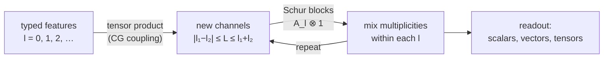

I spent the past few weeks doing something that would have sounded strange to
me a year ago: reading a neural network the way I would read a chapter of
Sakurai. Not training curves, not leaderboards — *structure*. This post is
what I found, written for someone who knows angular momentum coupling but
has never opened a machine-learning paper.

## 1. One sentence of machine learning

Strip away the mystique and a neural network is a parametrized function
\\(f_\theta(x)\\) fitted by gradient descent — variational calculus with a
very large ansatz. The input \\(x\\) might be the atomic coordinates of a
molecule; the output might be its energy, its dipole moment, or eventually
its entire single-particle Hamiltonian. "Training" means walking downhill
on a loss landscape. If you have ever minimized
\\(\langle\psi|H|\psi\rangle/\langle\psi|\psi\rangle\\) over a family of
trial wavefunctions, you already understand the mechanics. What you do
*not* yet understand is why anyone would choose one ansatz over another —
and that, it turns out, is exactly where physics re-enters.

## 2. The one equation that matters

Take a molecule and rotate it by \\(R\in\mathrm{SO}(3)\\). Its energy cannot
care. Its dipole moment must rotate with it. A network that respects this
is called *equivariant*, and the whole condition is one commutative
diagram:

$$
\begin{array}{ccc}
x & \xrightarrow{\;\;f\;\;} & f(x) \\\\[4pt]
\big\downarrow{\scriptstyle R} & & \big\downarrow{\scriptstyle R} \\\\[4pt]
Rx & \xrightarrow{\;\;f\;\;} & f(Rx)
\end{array}
$$

"Rotate, then compute" must agree with "compute, then rotate". For a
scalar output the right vertical arrow is the identity
(invariance, \\(f(Rx)=f(x)\\)); for a vector it is \\(R\\) itself; for a
rank-2 tensor it is \\(Q\mapsto RQR^{\mathsf T}\\). The general statement
hides in representation theory:

$$
f\big(D_X(g)\,x\big) \;=\; D_Y(g)\,f(x), \qquad g\in G ,
$$

and \\(f(Rx)=Rf(x)\\) is just the \\(l=1\\) case.

Why bother? Because Alice and Bob, describing the same crystal in two
rotated coordinate frames, must not receive incompatible predictions. A
generic network has to *learn* rotation invariance from data, expensively
and approximately; an equivariant network gets it by construction — the
same reason we solve the hydrogen atom in the basis of \\(|nlm\rangle\\)
instead of a generic grid. The sample-complexity benefit is not folklore:
it is a theorem [1](#refs).

## 3. Inside the white box

Once every intermediate quantity in the network is *typed* by an angular
momentum \\(l=0,1,2,\dots\\), the linear algebra writes itself, and it is
all our old friend Schur's lemma. A hidden layer
\\(W\\) is admissible only if it commutes with every rotation, and Schur
forces the solution into blocks:

$$
W \;=\; \bigoplus_l \left( A_l \otimes \mathbb{1}_{2l+1} \right) .
$$

The physics controls the representation index \\(m\\) (the network has no
business rotating the \\(m\\) components of an object it was handed as one
geometric whole); the learning happens only in the multiplicity spaces
\\(A_l\\) (how copies of the same type mix). The savings are absurd. For
\\(\mathcal H = 2V_0 \oplus 3V_1 \oplus V_2\\), a dimension-16 layer drops
from **256** free parameters to **14**.

New angular momenta are created, not by linear maps (Schur forbids mixing
types), but by tensor products — the network's version of adding angular
momenta, \\(V_1\otimes V_1 = V_0\oplus V_1\oplus V_2\\), with
Clebsch–Gordan coefficients doing the coupling. So the entire architecture
alternates two moves:

If this reminds you of the Wigner–Eckart theorem, it should — it *is* the
Wigner–Eckart theorem wearing an architecture:

$$
\langle jm|T^{(k)}_q|j'm'\rangle
\;=\;
C^{jm}_{j'm',kq}\;\langle j\Vert T^{(k)}\Vert j'\rangle .
$$

The Clebsch–Gordan factor is fixed by group theory and ships with the
network; the reduced matrix element is the physics, and that is precisely
the part the network is free to learn. An equivariant network is
Wigner–Eckart operationalized.

## 4. Allowed is not the same as needed

Here is the habit of mind I most want to keep from these weeks, and it
generalizes far beyond neural networks. Symmetry classifies what is
*permitted* — but a specific physical target lives on a much smaller
subspace of the permitted world, and three logically independent questions
should never be conflated:

1. **Admissibility** — does the structure respect the symmetry?
2. **Representability** — does the target actually lie in the space the
   structure can express? (Is the true state inside your variational
   ansatz?)
3. **Attainability** — will gradient descent actually *find* it, or does
   the loss landscape hide it behind a narrow winding valley?

Each implication fails in practice, and each failure mode is a different
disease with a different cure. An exactly covariant layer can be unable to
represent the torque it is asked to predict (a textbook failure of 2, with
1 fully green); a representable solution can sit in a basin so narrow that
training never recovers it (failure of 3). Recent literature maps both
sides: restricted output degrees can degenerate equivariant graph networks
outright [2](#refs), and the loss landscape of constrained
models can provably block their own global minima [3](#refs).
Separating the three levels — asking *which* one failed before reaching
for a fix — is, I have come to believe, the physicist's real contribution
to this conversation.

## 5. The part nobody puts on posters

The most valuable thing I watched this program do was *retract a claim*.
An apparent advantage of one architecture over a standard baseline
evaporated when someone noticed the comparison itself was measured through
a subtly wrong decoder. The correction was not buried; it was written into
the permanent record, next to the negative controls and the
preregistrations, with the same typographical dignity as the surviving
results.

Predeclared hypotheses. Frozen evidence hashes before the test set is
touched. Failures archived rather than deleted. This is the experimental
culture I was taught to associate with big collaborations, rebuilt from
scratch inside a codebase — and it changes what a "result" means. A number
that survives that gauntlet is simply more real. As training for a
physicist, watching honest retraction beat confident storytelling was
worth more than any single positive finding.

## 6. Where this is going

The program's question — *can physics choose, and certify, which of the
symmetry-allowed computations a target actually needs?* — sits exactly at
the boundary where group theory stops deciding things. I find that
boundary beautiful: the moment the representation theory runs out, the
science begins. I am currently occupied with coursework in Singapore, and
thinking about these questions is what I do between lectures — white-box
architectures, certified subspaces, and the honest bookkeeping that keeps
them accountable.

*Thanks to my advisor for a program where "we were wrong" is a
first-class sentence, and to the e3nn community for building machinery
transparent enough that a physicist can read it.*

## References {#refs}

**[1]** B. Elesedy and S. Zaidi, *Provably Strict Generalisation Benefit for
Equivariant Models*, ICML 2021 ([arXiv:2102.10333](https://arxiv.org/abs/2102.10333)).

**[2]** J. Cen, A. Li, N. Lin, Y. Ren, Z. Wang, W. Huang, *Are High-Degree
Representations Really Unnecessary in Equivariant Graph Neural Networks?*,
NeurIPS 2024.

**[3]** Y. Xie and T. Smidt, *A Tale of Two Symmetries: Exploring the Loss
Landscape of Equivariant Models*, NeurIPS 2025
([arXiv:2506.02269](https://arxiv.org/abs/2506.02269)).

**[4]** M. Geiger and T. Smidt, *e3nn: An open-source framework for
equivariant deep learning*, 2022
([arXiv:2207.09453](https://arxiv.org/abs/2207.09453)).
